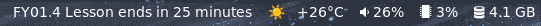

# wilma-bar
Shows you when your current lesson ends, or your next lesson starts. In your favorite statusbar.


# Installation
```
git clone https://github.com/RitariME/wilma-bar
cd wilma-bar
cargo run
```
# Login wilma
Open `~/.config/wilma-tui/config` with your favorite text editor and insert your wilma credentials and inschool.fi url like this
```
yourwilma@emailadress.fi (or your username)
yourwilmapassword
https://your.inschool.fi
```
# Usage
Running wilma-bar prints the message to standard output.
Pipe the message to your statusbar.

This is how I do it in Waybar:
```
"custom/wilma": {
	"exec": "~/projekt/wilma-bar/target/debug/wilma-bar",
	"restart-interval": 60,
}
```
